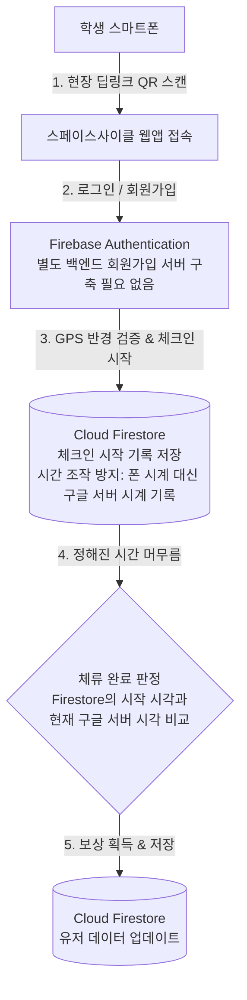

# Space Cycle

## 1. 개발 배경 (Motivation)

대학교 캠퍼스에는 잘 알려지지 않아 잘 사용되지 않는 '유휴 공간'들이 존재합니다.
Space Cycle은 학생들의 이러한 공간을 직접 찾아가 머물도록 유도하여 캠퍼스 공간의 활동도를 높이고 재발견을 돕는 위치 기반 게이미피케이션(Gamification) 웹앱입니다.

---

## 2. 핵심 기능 (Key Features)

- 흑백 < -- > 컬러 공간 도감 (My Page) : 미방문 공간은 흑백 처리, 방문 인증 완료 시 컬러로 해금되어 수집욕 자극.
- 체류 기반 마스코트 스티커 보상 : 단순 방문이 아닌 일정 시간을 체류하면 해당 장소의 고유 마스코트 스티커 발급 및 My Page에 저장.
- 공간 스토리 : 체류 시간을 보내는 동안 해당 공간의 이야기를 보여줌.

---

## 3. 기술적 의사결정(Engineering Decisions)
- Q. 단순 QR 스캔 VS 딥링크(Deep Link) QR 스캔 : 
  - 웹앱에 직접 접속해 스캐너를 켜는 번거로운 UX를 제거하기 위해, 기본 스마트폰 카메라로 스캔 시, 장소 식별자와 함께 즉시 인증 페이지로 리다이렉트 되는 QR 방식을 채택.

- Q. 부정 인증 방식 : 
  - QR 사진을 미리 찍고 다른 공간에서 인증을 방지하기 위해 GPS 반경(Radius) 검증을 결합한 이중 인증을 적용.
  - 클라이언트(웹앱 접속 디바이스)의 시계 조작 어뷰징을 방지하기 위해, 체류 시간 판정은 전적으로 서버 시계를 기준으로 검증.

- Q. HTTPS 필요성 : 
  - 모바일 웹 환경에서 카메라, GPS 보안 정책을 충족하기 위해 SSL/TSL 인증서 기반 HTTPS 환경을 필수로 구성해야함.

- Q. DB 및 사용자 검증 : 
  - Google FireBase를 이용하여 학생들의 접근성을 높여 불편한 로그인 과정을 구글 원클릭 로그인으로 대체.
  - 별도의 무거운 DB를 서버에 설치해 이용하지 않고 클라우드 DB의 강점을 활용.

---

## 4. 시스템 흐름도 (System Flowchart)

